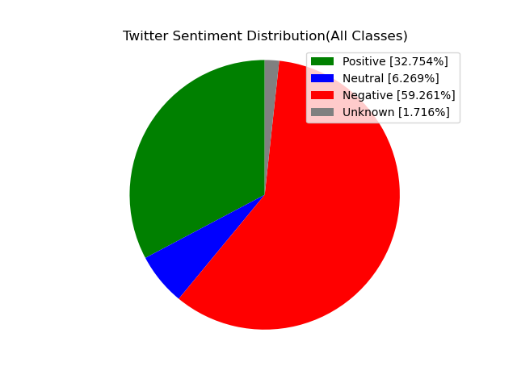
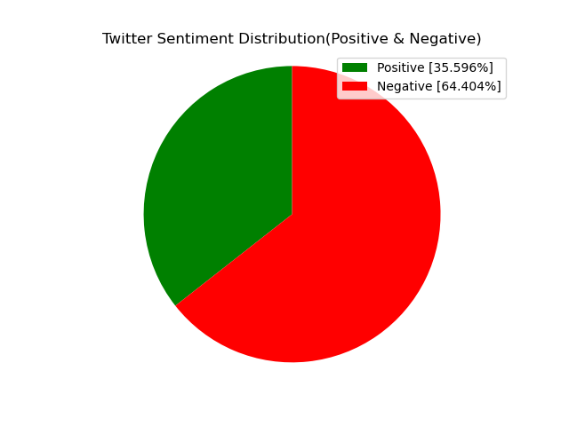
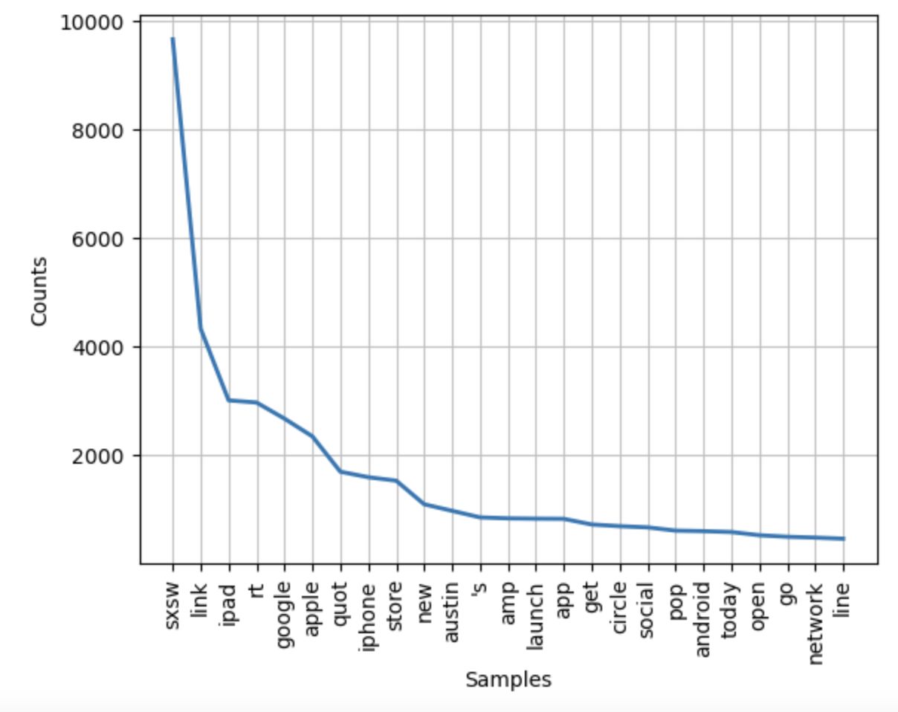
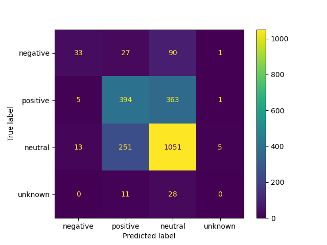

# Twitter Sentiment Analysis
Author: Christopher Varghese

## Overview
This project is focused around accurately identifying positive, negative, or neutral sentiment in a Tweet. The necessary goals of this project are to:
- Acquire the data, in this case Tweets
- Clean the data so that it can be processed and vectorized for modelling
- Analyzing various features of the data
- Modelling the data using various classifiers and iterating better versions

## Business Problem
Twitter is one of the biggest social platforms to exist. Unlike its competitors such as facebook and instagram, the 'posts' on 
Twitter are small snippet messages, referred to as Tweets. These Tweets can often be categorized under a particular hashtag or contain key words 
that relate it to a certain topic. Therefore, developing a model that can extract sentiment from Tweets has a multitude of advantages for a business. 
First, it can be a tool to gather data on public opinion regarding a product or service. Second, it can be used to gather information on a competitors 
product or service. Moreover, applications extend into the political realm where public opinion is likely the greatest metric to guarantee success in 
an election. This project aims to give this leverage to the parties that are interested.

## Data Understanding
This data was obtained from data.world. It consists of 9,092 tweets that were labeled as positive, negative, neutral, or undetermined by real users. Each tweet 
has three associated columns: the actual tweet, the topic of the tweet, and the determined emotion. When all the tweets are combined after cleaning, there are 
106,471 total words and 7,796 unique words.

This graphic shows the distribution of various sentiments through out the data set of tweets. We can also display the ratio of positive to negative tweets.

After cleaning the data and applying lemmatization, a process in which all words are reduced down to its most basic form, this is a graph of the most common words:

This shows how some of the most common words may also be the least informative to helping us determine the sentiment of each tweet.

## Modelling
For my models I used the multinomial Naive Bayes classifier, the Random Forest classifier, and the Logistic Regression model. These are all strong models that have yielded strong results when working with text data. After applying oversampling and final testing the Random Forest model seemed to perform the best.

## Conclusion and Next Steps
These models show some success in predicting Twitter sentiment. At this time, I would reccomend the Random Forest Classification model. This model was relatively successful in extracting both negative and positive tweets, and is conservative in how many inaccuracies it is making compared to the rest of the models. That being said I would like to point out a few flaws and potentially next steps for this project.

The Data: The data seems to be very heavily grounded in tech, with the number one key word being a hashtag for a tech confrence. Furthermore, iPad, Google, Apple, and iPhone are extremely prevalent key words. I believe this model is possibly associating certain tech words or brands with positive or negative sentiment. The process must be repeated with a larger data set that has a diverse field of interest.

Further Tuning: Although I believe my concerns about the data are more pressing, all of these models definitely could have benefitted from an extensive grid search. This would have allowed all the models to be tuned to the precise settings that would yield the greatest extraction of each target.

More Models and Embedding: There are some more complex models for NLP research as well as strategies to increase deep learning and yield better results. I believe that this project is a good base and would highly benefit from these strategies.
